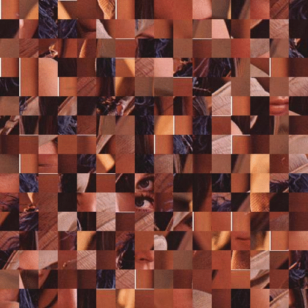
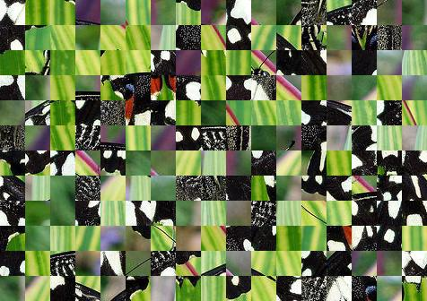

# gaps

Automatic Genetic Algorithm-Based Solver for Jigsaw Puzzles.

[](https://semaphoreci.com/nemanja-m/gaps)

<p align="center">
  
</p>

# Installation

Clone repo:

```bash
$ git clone https://github.com/nemanja-m/gaps.git
$ cd gaps
```

Install requirements:

```bash
$ pip install -r requirements.txt
$ sudo apt-get install python-tk
```

Install project in editable mode:

```bash
$ pip install -e .
```

# Creating puzzles from images

To create puzzle from image use `create_puzzle` script.

i.e.

```bash
$ create_puzzle images/butterfly.jpg --size=28 --destination=puzzle.jpg
```

will create puzzle from `lena.jpg` where each puzzle piece is 28x28 pixels.
Run `create_puzzle --help` for detailed help.

Puzzle is created from input image by shuffling pieces.

<div align="center">
  
  &nbsp; &nbsp; &nbsp; &nbsp; &nbsp; &nbsp;
  
</div>

__NOTE__ *Created puzzle dimensions may be smaller then original image depending on
given puzzle piece size. Maximum possible rectangle is cropped from original image.*

# Solving puzzles

In order to solve puzzles, use `gaps` script.

i.e.

```bash
$ gaps --image=puzzle.jpg --size=28 --generations=20 --population=300
```

This will start genetic algorithm with initial population of 300 and 20 generations.

Following options are provided:

Option          | Description
--------------- | -----------
`--image`       | Path to puzzle
`--size`        | Puzzle piece size in pixels
`--generations` | Number of generations for genetic algorithm
`--population`  | Number of individuals in population
`--verbose`     | Show best solution after each generation
`--save`        | Save puzzle solution as image

Run `gaps --help` for detailed help.

# License

This project as available as open source under the terms of the [MIT License](http://opensource.org/licenses/MIT)
