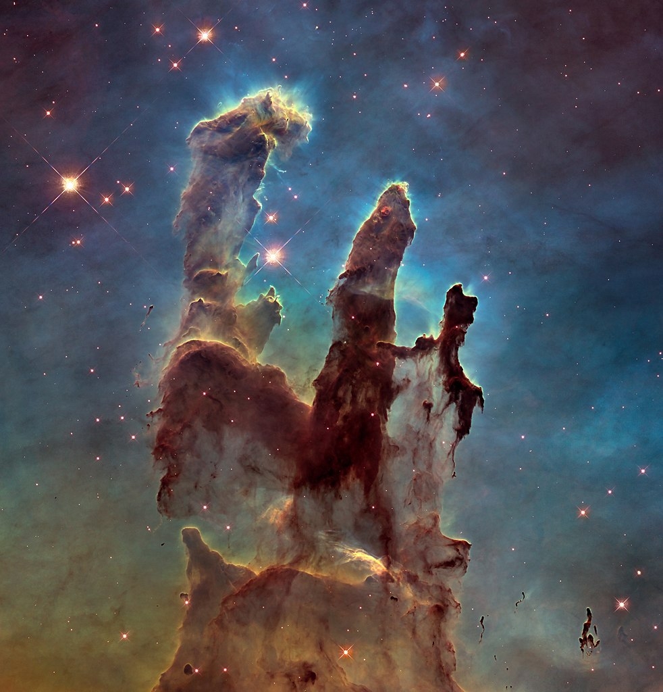

<h1 align=center>

</h1>


Genetic Algorithm based solver for jigsaw puzzles with piece size auto-detection.

[](https://semaphoreci.com/nemanja-m/gaps)

<p align="center">
  
</p>

# Installation

Clone repo:

```bash
$ git clone https://github.com/nemanja-m/gaps.git
$ cd gaps
```

Install requirements:

```bash
$ pip install -r requirements.txt
$ sudo apt-get install python-tk
```

Install project in editable mode:

```bash
$ pip install -e .
```

# Creating puzzles from images

To create puzzle from image use `create_puzzle` script.

i.e.

```bash
$ create_puzzle images/pillars.jpg --size=48 --destination=puzzle.jpg

[SUCCESS] Puzzle created with 420 pieces

```

will create puzzle with `420` pieces from `images/pillars.jpg` where each piece is 48x48 pixels.

<div align="center">
  
  &nbsp; &nbsp; &nbsp; &nbsp; &nbsp; &nbsp;
  
</div>

Run `create_puzzle --help` for detailed help.

__NOTE__ *Created puzzle dimensions may be smaller then original image depending on
given puzzle piece size. Maximum possible rectangle is cropped from original image.*

# Solving puzzles

In order to solve puzzles, use `gaps` script.

i.e.

```bash
$ gaps --image=puzzle.jpg --generations=20 --population=600
```

This will start genetic algorithm with initial population of 600 and 20 generations.

Following options are provided:

Option          | Description
--------------- | -----------
`--image`       | Path to puzzle
`--size`        | Puzzle piece size in pixels
`--generations` | Number of generations for genetic algorithm
`--population`  | Number of individuals in population
`--verbose`     | Show best solution after each generation
`--save`        | Save puzzle solution as image

Run `gaps --help` for detailed help.

## Size detection

If you don't explicitly provide `--size` argument to `gaps`, piece size will be detected automatically.

However, you can always provide `gaps` with `--size` argument explicitly:

```bash
$ gaps --image=puzzle.jpg --generations=20 --population=600 --size=48
```

__NOTE__ *Size detection feature works for the most images but there are some edge cases
where size detection fails and detects incorrect piece size. In that case you can
explicitly set piece size.*

## Termination condition

The termination condition of a Genetic Algorithm is important in determining when a GA run will end.
It has been observed that initially, the GA progresses very fast with better solutions coming in every few iterations,
but this tends to saturate in the later stages where the improvements are very small.

`gaps` will terminate:

* when there has been no improvement in the population for `X` iterations, or
* when it reachs an absolute number of generations

# License

This project as available as open source under the terms of the [MIT License](http://opensource.org/licenses/MIT)
