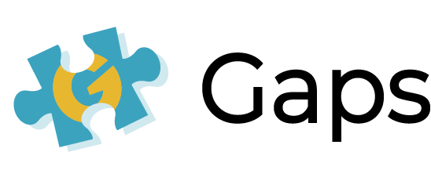
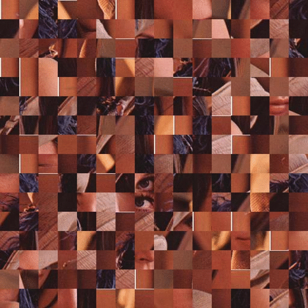
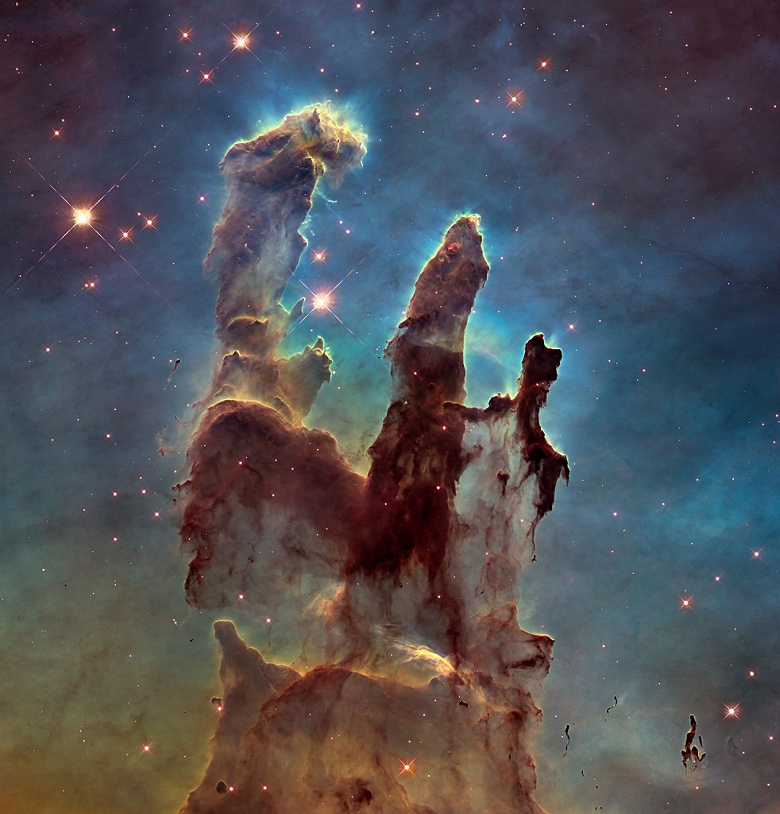
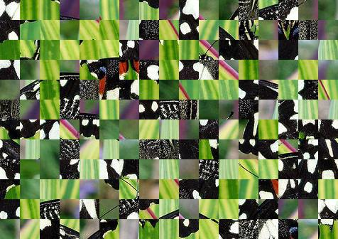

<h1 align=center>
  
</h1>

Genetic Algorithm based solver for jigsaw puzzles with piece size
auto-detection.

[](https://github.com/nemanja-m/gaps/actions/workflows/ci.yml)

<p align="center">
  
</p>

# Installation

Python 3.12.x is required.

Clone repo:

```bash
git clone https://github.com/nemanja-m/gaps.git
cd gaps
```

Install [uv](https://docs.astral.sh/uv/getting-started/installation/) if it is not already available:

```bash
# macOS and Linux
curl -LsSf https://astral.sh/uv/install.sh | sh

# Windows PowerShell
powershell -ExecutionPolicy ByPass -c "irm https://astral.sh/uv/install.ps1 | iex"
```

Install the project and development requirements with uv:

```bash
uv sync
```

The `gaps` command is installed in the project environment. Run it with `uv run`:

```bash
uv run gaps --help
```

# Creating puzzles from images

To create a puzzle from an image, use `uv run gaps create`:

```bash
uv run gaps create images/pillars.jpg puzzle.jpg --size=64
```

will create puzzle with 240 pieces from `images/pillars.jpg` where each piece is
64x64 pixels.

<div align="center">
  
  &nbsp; &nbsp; &nbsp; &nbsp; &nbsp; &nbsp;
  
</div>

Run `uv run gaps create --help` for detailed help.

__NOTE__: Created puzzle image dimensions may be smaller then original image
depending on the given puzzle piece size. Pass `--seed` to `gaps create` or
`gaps run` when reproducible shuffling and solving are required. Maximum possible rectangle is cropped
from original image.

# Solving puzzles

To solve a puzzle, use `uv run gaps run`:

```bash
uv run gaps run puzzle.jpg solution.jpg --generations=20 --population=600
```

This will start genetic algorithm with initial population of 600 and 20 generations.
For CPU-bound child generation, use multiple worker processes:

```bash
uv run gaps run puzzle.jpg solution.jpg --generations=20 --population=600 --workers=4
```

Worker mode uses deterministic per-child seeds, so runs with the same input,
seed, and worker count are reproducible. The serial mode (`--workers=1`) remains
the reference backend, and parallel runs may produce a different valid genetic
search trajectory.

Following options are provided:

Option          | Description
--------------- | -----------
`--size`        | Puzzle piece size in pixels
`--generations` | Number of generations for genetic algorithm
`--population`  | Number of individuals in population
`--debug`       | Show the best solution after each generation
`--seed`        | Use a reproducible random seed
`--workers`     | Number of processes used to build children

Run `uv run gaps run --help` for detailed help.

## Solver approach

The solver assumes a known rectangular layout and fixed piece orientation. It:

1. extracts directed horizontal and vertical edge costs using robust pixel and
   gradient comparisons;
2. mixes confidence-aware beam-searched arrangements with random arrangements
   to initialize the population;
3. evolves valid permutations with tournament selection and crossover that
   preserves strong parent edges and high-confidence blocks;
4. applies adaptive mutation, local search over swaps/relocations/block moves,
   elitism, and stagnation-triggered restarts; and
5. returns the best valid arrangement found, with optional process workers for
   child generation.

This combination uses image-derived compatibility to build useful regions while
retaining genetic diversity for ambiguous edges and repetitive textures.

## Grayscale images

Grayscale PNG/JPEG images are supported as native single-channel images. The
fitness function uses normalized robust edge and gradient costs, and the solver
also applies improving swap mutations to avoid early convergence on ambiguous
edges.

A deterministic manual validation puzzle is available in
`images/grayscale/README.md`.

## Size detection

If you don't explicitly provide the `--size` argument to `uv run gaps run`,
the piece size will be detected automatically.

However, you can always provide `uv run gaps run` with the `--size` argument
explicitly:

```bash
uv run gaps run puzzle.jpg solution.jpg --generations=20 --population=600 --size=48
```

__NOTE__: Size detection feature works for the most images but there are some edge cases
where size detection fails and detects incorrect piece size. In that case you can
explicitly set piece size.

## Termination condition

The termination condition of a Genetic Algorithm is important in determining
when a GA run will end.  It has been observed that initially, the GA progresses
very fast with better solutions coming in every few iterations, but this tends
to saturate in the later stages where the improvements are very small.

`gaps` will terminate:

* when there has been no improvement in the population for `X` iterations, or
* when it reaches an absolute number of generations

# References

BibTeX entry:

```text
@article{Sholomon2016,
  doi = {10.1007/s10710-015-9258-0},
  url = {https://doi.org/10.1007/s10710-015-9258-0},
  year = {2016},
  month = feb,
  publisher = {Springer Science and Business Media {LLC}},
  volume = {17},
  number = {3},
  pages = {291--313},
  author = {Dror Sholomon and Omid E. David and Nathan S. Netanyahu},
  title = {An automatic solver for very large jigsaw puzzles using genetic algorithms},
  journal = {Genetic Programming and Evolvable Machines}
}
```

# License

This project as available as open source under the terms of the [MIT License](http://opensource.org/licenses/MIT)
